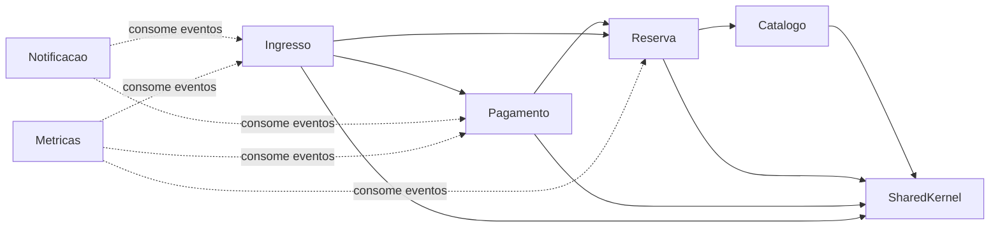
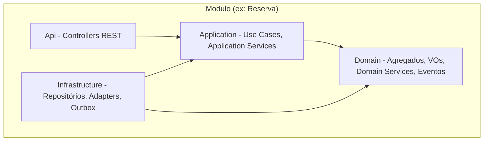
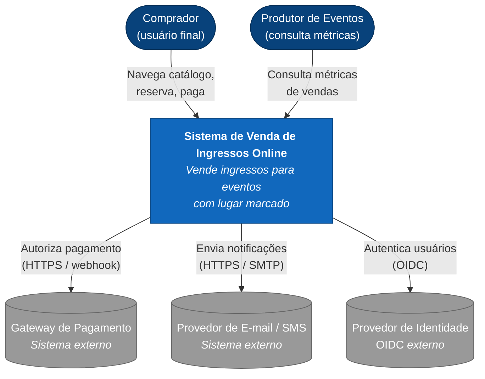
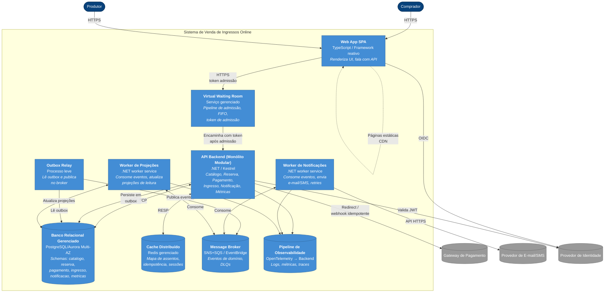

# 7. Decisões Arquiteturais (ADRs)

As decisões abaixo seguem um formato baseado no que Michael Nygard propôs para ADRs: Status, Contexto, Decisão, Alternativas Consideradas, Trade-offs e Riscos. São cinco ADRs (uma a mais do que o mínimo pedido) porque cada uma trata de uma dimensão que não dá pra deduzir das outras. A ideia de um ADR não é documentar tecnologia; é registrar o raciocínio por trás de uma escolha que vai ser cara de mudar.

---

## ADR-001 — Adoção de Monólito Modular como Estilo Arquitetural Principal

**Status:** Aceito — 2026-05-24
**Decisores:** Arquiteto responsável (Christian Chiavelli), com homologação do time de engenharia e produto.

### Contexto

Sistema greenfield, prazo comercial agressivo, equipe enxuta (6 a 10 engenheiros) sem cultura instalada de operação distribuída. Três drivers prioritários: (1) consistência que não pode falhar no seat-locking, (2) escalabilidade elástica para picos extremos, (3) time-to-market e simplicidade. A tentação imediata da indústria é responder com microsserviços; essa tentação precisa ser confrontada com rigor, não por conservadorismo, mas por avaliação contextual.

Tenho uma preferência declarada por monólito modular, em parte por experiência: já vi mais sistemas sofrerem com microsserviços prematuros do que com monólitos disciplinados. Isso não é dogma. É observação de campo, e quero deixar claro que essa decisão é revisável quando o contexto mudar.

### Decisão

Adotar **Monólito Modular** como estilo principal, com:

- **Um único deployable** contendo todos os bounded contexts (Catálogo, Reserva, Pagamento, Ingresso, Notificação, Métricas).
- **Modularidade interna rigorosa**: cada bounded context em namespace/projeto isolado, com fronteiras explícitas por interfaces de aplicação e eventos de domínio.
- **Schemas de banco separados por módulo** dentro de um mesmo cluster relacional gerenciado (ADR-005).
- **Comunicação inter-módulo preferencialmente por eventos de domínio** (ADR-004) para fluxos não-críticos; chamadas síncronas inter-módulo apenas no caminho transacional Reserva-Pagamento-Ingresso.
- **Gancho de extração** documentado para o módulo Reserva (§16).

### Alternativas Consideradas

| Alternativa | Prós | Contras (neste contexto) |
|---|---|---|
| **Microsserviços puro** (cada bounded context como serviço autônomo) | Escalabilidade granular; deploys independentes; isolamento de falha forte | Custo operacional desproporcional ao estágio; Sagas necessárias para seat-locking + pagamento (caras, com janela observável de inconsistência); rede como ponto de falha; exige maturidade em tracing distribuído, mTLS, service discovery, schema registry, contract testing, nada disso instalado culturalmente |
| **Monólito tradicional** (camadas técnicas, sem separação por contexto) | Máxima simplicidade inicial | Vira *big ball of mud* em 12 meses; inviabiliza extração futura sem reescrita; alto risco de acoplamento indesejado entre subdomínios |
| **SOA com ESB** | Reutilização entre canais; orquestração centralizada | Overkill para um único canal; ESB é peso operacional injustificado; arquitetura envelhecida para este tipo de sistema |
| **Event-Driven puro coreografado** | Desacoplamento máximo; escalabilidade natural | Tracing de fluxo de negócio é difícil; consistência de seat-locking exige Sagas; consistência eventual no caminho crítico é inaceitável |
| **Serverless puro (FaaS)** | Elasticidade automática; pay-per-use | Cold starts incompatíveis com p95 < 300 ms; transações ACID em FaaS são estranhas de usar; lock-in alto; observabilidade fragmentada |

### Trade-offs e Riscos

- **Trade-off aceito:** escalabilidade granular é sacrificada. Escala-se o monólito inteiro, não o módulo Reserva isoladamente. A mitigação é que o gargalo real nos picos é o banco, não a CPU dos pods; autoscaling horizontal dos pods é barato e linear.
- **Risco:** sem disciplina, módulos vazam fronteiras e o monólito modular degenera em monólito tradicional. **Mitigação:** análise estática de dependências em CI; revisão obrigatória; schemas separados.
- **Risco organizacional:** equipe pode interpretar a decisão como "evitar microsserviços por covardia". **Mitigação:** este ADR documenta a decisão como deliberada e revisável, não como dogma.
- **Impacto organizacional:** facilita onboarding. Um repositório, um pipeline, um conjunto de dashboards.

### Antipadrões Deliberadamente Evitados

- **Microservice envy**: adotar microsserviços por moda, sem driver real que o justifique.
- **Distributed monolith**: extrair serviços sem isolar dados, gerando sistema distribuído com acoplamento de monólito.
- **Big ball of mud**: monólito sem fronteiras internas.
- **Ivory tower architect**: decisão arquitetural desligada da realidade do time.

---

## ADR-002 — Estratégia de Seat-Locking via Reserva Temporária com TTL em Transação ACID Local

**Status:** Aceito — 2026-05-24

### Contexto

O seat-locking é o **ponto de maior risco do sistema** e o gargalo central nos picos. Em uma abertura de venda, milhares de usuários disputam um conjunto pequeno de assentos. A regra é absoluta: um assento, uma venda. Há três famílias conhecidas de solução:

1. **Lock pessimista no banco** com `SELECT ... FOR UPDATE`.
2. **Lock distribuído** via Redis (Redlock) ou ZooKeeper.
3. **Reserva temporária com TTL** materializada em tabela com índice único parcial sobre estado ativo.

Esse foi o ponto que mais me deu trabalho para decidir. A opção 2 (Redlock) parece elegante à primeira vista e eu cheguei a considerá-la com seriedade. Mas Kleppmann (2016) demonstrou de forma convincente que Redlock não é seguro sob pressupostos realistas de relógio e GC. Os failure modes em particionamento de rede não são teóricos: são situações que qualquer sistema em produção vai enfrentar eventualmente.

### Decisão

Adotar **estratégia (3): reserva temporária com TTL em transação ACID local**, com a seguinte mecânica:

```sql
INSERT INTO reserva.seat_reservation
    (event_id, seat_id, user_id, status, expires_at, created_at)
VALUES
    (:event_id, :seat_id, :user_id, 'HELD', NOW() + INTERVAL '7 minutes', NOW())
ON CONFLICT (event_id, seat_id)
    WHERE status IN ('HELD','CONFIRMED')
DO NOTHING
RETURNING reservation_id;
```

- A combinação `(event_id, seat_id)` tem **índice único parcial** sobre estados ativos, garantindo *at-most-once* sem lock explícito.
- Se o `RETURNING` vier vazio, o assento já está reservado. Falha imediata, sub-milissegundo.
- TTL de 5 a 10 minutos, suficiente para o pagamento.
- Job de expiração em background move reservas `HELD` expiradas para `EXPIRED`, liberando o assento.
- A confirmação do pagamento dispara `HELD → CONFIRMED` em transação ACID, atômica com a emissão do ingresso.

### Alternativas Consideradas

| Alternativa | Prós | Contras |
|---|---|---|
| **(1) `SELECT ... FOR UPDATE` pessimista** | Semântica explícita; isolamento garantido | Mantém lock durante toda a interação do usuário (incluindo tempo do gateway externo), o que degrada vazão; risco de lock escalation; sensível a sessões zumbi; bloqueia conexão do pool por minutos |
| **(2) Lock distribuído Redlock** | Move o lock para fora do banco; vazão alta | Failure modes complexos em particionamento de rede (Kleppmann, 2016); exige fencing tokens para ser correto; adiciona Redis como dependência crítica do caminho de consistência |
| **(3) Reserva temporária com TTL + índice único parcial** *(adotada)* | Atomicidade no banco; sem locks longos; barato; a "reserva" *é* uma entidade visível no domínio | Requer índice parcial bem desenhado; requer job de expiração confiável; exige idempotência em todo o caminho |
| **(4) Filas particionadas por assento** | Serialização natural; alta vazão | Granularidade absurda (uma fila por assento); complexidade desproporcional |

### Riscos e armadilhas conhecidas

- **Trade-off aceito:** introduz uma entidade `seat_reservation` com ciclo de vida explícito, que precisa de manutenção (expiração). Aceitável: ela é também a fonte de verdade para auditoria e telemetria.
- **Risco:** se o job de expiração falhar, assentos ficam presos como `HELD` além do TTL. **Mitigação:** job idempotente, executado por múltiplas instâncias com lock de cluster; alerta se o lag de expiração exceder 60s.
- **Risco:** após `CONFIRMED`, qualquer estorno exige um caminho de compensação. **Mitigação:** estornos estão fora de escopo no MVP; quando entrarem, a transição `CONFIRMED → REFUNDED` será explícita.
- **Impacto organizacional:** o time precisa entender que reserva é um agregado de primeira classe, não um efeito colateral do carrinho.
- **Armadilhas a evitar:** locks distribuídos sem fencing tokens; manter lock durante I/O externo (o erro clássico de segurar `FOR UPDATE` enquanto o usuário está no redirect para o gateway); inferir disponibilidade por contagem, que é sujeito a race conditions.

---

## ADR-003 — Pipeline de Admissão (Virtual Waiting Room) na Entrada de Vendas

**Status:** Aceito — 2026-05-24

### Contexto

Aberturas de venda de eventos populares geram **chegadas correlatas**: dezenas de milhares de usuários no mesmo segundo, comportamento muito distinto de Poisson. Sem mecanismo de absorção, esse pulso derruba o banco por exaustão de conexões e contenção de locks, gera latência catastrófica para todos, e cria a percepção de injustiça ("ele entrou e eu não, por quê?"). Esta é a manifestação prática do atributo de *fairness* levantado nos drivers implícitos.

Na empresa onde trabalho hoje, já lidei com sistemas que simplesmente soltavam o tráfego direto no backend durante picos, confiando em autoscaling. O resultado foi previsível: o banco não escala verticalmente rápido o suficiente, os timeouts em cascata começam, e o sistema vira um retry storm. Não quero repetir isso aqui.

### Alternativas Consideradas

| Alternativa | Prós | Contras |
|---|---|---|
| **Sem fila, confiar em autoscaling + rate limit** | Simplicidade | Autoscaling não escala um banco vertical em segundos; rate limit por IP é injusto (NAT corporativo, mobile carriers) e não preserva ordem |
| **Fila de mensageria (SQS/Kafka) acoplada à API** | Reuso de infra | Mensageria não foi projetada como waiting room; falta UX de "minha posição"; falta TTL natural; degrada para retry storm |
| **Loteria (sorteio entre usuários)** | Não exige fila | Catastrófico em UX; viola fairness percebida |
| **Throttling cooperativo no front-end** | Barato | Trivialmente contornável por devtools e bots; zero garantia |
| **Virtual waiting room dedicada** *(adotada)* | Solução padrão da indústria de ticketing; preserva ordem; UX previsível | Custo adicional (serviço gerenciado); dependência crítica adicional |

### Decisão

Implementar uma **virtual waiting room** como **pipeline de admissão** entre o load balancer e a API transacional, com:

- **Fila gerenciada externa** (serviço gerenciado de waiting room, como Queue-it, ou solução interna sobre Redis Streams com cuidado na corretude).
- **FIFO por timestamp de chegada**, com tolerância a folga de poucos milissegundos.
- **Janela de admissão dinâmica** controlada por token bucket: o sistema admite N usuários por segundo conforme a saúde do backend (vazão observada e latência da reserva).
- **Token de admissão criptografado** (JWT curto, assinado), validado na API. Sem token válido → 403. Token tem TTL e uso único contra replay.
- **Página de espera com posição estimada**, atualizada via long-polling/SSE.

### Trade-offs e Riscos

- **Trade-off aceito:** introduz uma dependência crítica na borda. Sua queda derruba a admissão. **Mitigação:** fallback degradado para rate limit estrito e página de "venda momentaneamente indisponível", o que é preferível a derrubar o backend inteiro.
- **Risco:** janela de admissão mal calibrada pode deixar o backend ocioso (admissão lenta demais) ou saturado (admissão rápida demais). **Mitigação:** controlador adaptativo realimentado por métricas de latência p95 da reserva.
- **Impacto organizacional:** produto precisa entender que "tem fila" não é falha. É uma decisão deliberada de preservar fairness e estabilidade.

---

## ADR-004 — Comunicação Assíncrona via Eventos de Domínio para Fluxos Não-Críticos

**Status:** Aceito — 2026-05-24

### Contexto

Notificações por e-mail/SMS, métricas para produtores, projeções de leitura e auditoria são funcionalidades que **não precisam ser síncronas** com o commit da transação de compra. Acoplá-las síncronamente significa: (a) latência do caminho crítico amarrada ao provedor externo; (b) falha do provedor vira falha da compra; (c) cada nova feature exige tocar o caminho crítico.

### Como cheguei a essa decisão

Inicialmente cheguei a considerar apenas enriquecer as chamadas síncronas com circuit breakers e timeouts agressivos para isolar a latência do provedor externo. Quer dizer, mais precisamente, achei por um momento que isolamento era suficiente, sem precisar de um broker inteiro. Mas ao detalhar os casos de uso percebi que o problema não era só latência: era que qualquer nova funcionalidade que precisasse reagir a uma compra confirmada ia ter que tocar o caminho crítico de alguma forma. E com o Outbox pattern, a garantia transacional fica no banco mesmo, sem dual write e sem complexidade adicional no caminho de compra.

### Decisão

Adotar **espinha dorsal orientada a eventos** para fluxos não-críticos, com:

- **Broker gerenciado** (preferência: SNS+SQS, ou EventBridge, ou alternativa equivalente com semântica *at-least-once*).
- **Eventos de domínio** publicados pelo módulo dono do agregado, no formato `<Contexto>.<Evento>.v<N>` (ex.: `Reserva.Confirmada.v1`).
- **Outbox pattern**: eventos são gravados em uma tabela `outbox` na **mesma transação** que persiste a mudança de estado; um *relay* lê o outbox e publica no broker, garantindo "publicado se e somente se commitado".
- **Idempotência** obrigatória nos consumidores (chave de idempotência derivada do `event_id`).
- **Schema registry** para os eventos, com versionamento e evolução compatível.
- **Dead Letter Queue** com observabilidade e processo de re-drive manual.

### Alternativas Consideradas

| Alternativa | Prós | Contras |
|---|---|---|
| **Chamadas síncronas inter-módulo (HTTP/in-process)** | Simplicidade conceitual | Acopla latência e disponibilidade; falha externa propaga para o usuário; cada novo consumer toca o produtor |
| **Outbox + polling sem broker** | Sem dependência de broker | Reinventa a roda; complexidade de garantir ordering, retry, fanout |
| **Event sourcing puro como modelo primário** | Auditoria gratuita; replay completo | Curva de aprendizado alta; complexidade desproporcional ao domínio |
| **Broker auto-gerenciado (Kafka cluster próprio)** | Capacidade e flexibilidade máximas | Custo operacional altíssimo; exige time dedicado |
| **Outbox + broker gerenciado** *(adotada)* | Garantia transacional; baixo custo operacional; padrão maduro | Latência de propagação ligeiramente maior (segundos no pior caso); exige disciplina de schema |

### Trade-offs e Riscos

- **Trade-off aceito:** consumidores enxergam estado eventualmente consistente. Para notificações e métricas isso é o esperado.
- **Risco:** consumidor não-idempotente envia dois e-mails para o mesmo evento. **Mitigação:** chave de idempotência por `event_id` no consumidor; tabela `processed_events`.
- **Risco:** evolução incompatível de schema quebra consumidores. **Mitigação:** versionamento explícito (`v1`, `v2`) com período de coabitação; contract tests.
- **Impacto organizacional:** engenheiros precisam pensar em fluxos disparados por eventos como algo de primeira classe; logs e tracing precisam correlacionar produtor/consumidor por `correlationId`.

Antipadrões que essa decisão evita explicitamente: dual write (escrever no banco e no broker sem garantia transacional), eventos usados como RPC disfarçado (com expectativa de resposta), e lógica de negócio no broker.

---

## ADR-005 — Isolamento de Schemas por Módulo dentro de Cluster Relacional Único

**Status:** Aceito — 2026-05-24

Mesmo dentro de um monólito modular, a forma como os dados são organizados determina o nível de acoplamento real. O antipadrão clássico é o *shared database*, que é particularmente perigoso porque é convidativo: nada impede tecnicamente um módulo de fazer `JOIN` no schema alheio "só dessa vez". Em 12 meses, os módulos ficam acoplados pelo banco e o gancho de extração futura morre.

A decisão é simples de enunciar: **um banco relacional gerenciado, schemas separados por módulo, acesso cross-schema proibido por convenção e por revisão de código.** Os schemas são `catalogo`, `reserva`, `pagamento`, `ingresso`, `notificacao` e `metricas`. Cada módulo tem usuário de banco próprio com permissão apenas sobre o seu schema (least privilege). As migrations são versionadas por schema; cada módulo gerencia as suas. Análise estática em CI detecta uso de tabelas fora do schema próprio.

Quando um módulo precisa de dados de outro, a forma correta é uma de duas: consumir eventos de domínio que materializam projeções locais no consumidor (preferencial), ou chamar a API interna in-process do módulo dono. Nunca SQL direto cross-schema.

As alternativas consideradas foram: schema único compartilhado (descartado porque viabiliza acoplamento invisível e inviabiliza extração futura), banco por módulo desde o dia 1 (descartado pelo custo operacional e porque tornaria transações ACID cross-module impossíveis, exigindo Sagas já no monólito), e database views como superfície cross-module (descartado porque views como API são frágeis e versionadas no banco). A opção de schemas por módulo no mesmo cluster equilibra isolamento lógico com custo operacional baixo, e mantém a possibilidade de transações ACID quando necessário.

O principal risco é que sob pressão alguém faça um `JOIN` cross-schema "só pra essa feature". A mitigação é que o usuário de banco por módulo combinado com o lint de análise estática tornam a violação um ato ativo, não passivo. Quem violar vai ter que forçar a passagem explicitamente. O cluster único é SPOF; mitigação: multi-AZ síncrono, PITR e runbooks de failover ensaiados.

Quando o módulo Reserva for extraído, o schema `reserva` migra inteiro para o serviço novo; o restante do código continua chamando a antiga interface, agora satisfeita por um adapter HTTP.

---

# 8. Avaliação Comparativa de Estilos Arquiteturais

A escolha do Monólito Modular (ADR-001) só é defensável depois de comparar a alternativa contra um conjunto significativo de estilos. Esta seção formaliza a comparação. Nenhum estilo é descartado pela teoria; todos são descartados (ou escolhidos) pelo contexto.

## 8.1. Critérios de Avaliação

Uso as dimensões propostas por Richards e Ford (2020) adaptadas aos drivers deste sistema. Cada dimensão é avaliada de 1 (fraco) a 5 (forte) **neste contexto específico**.

| # | Critério |
|---|---|
| C1 | Adequação à consistência forte no seat-locking |
| C2 | Capacidade de absorver picos extremos |
| C3 | Time-to-market e simplicidade operacional |
| C4 | Modularidade interna |
| C5 | Custo operacional |
| C6 | Evolutibilidade (caminho de mudança no futuro) |
| C7 | Testabilidade |
| C8 | Aderência à maturidade atual do time |

## 8.2. Tabela Comparativa

| Estilo | C1 Cons. | C2 Pico | C3 TTM | C4 Modul. | C5 Custo | C6 Evol. | C7 Test. | C8 Time | Soma | Veredito |
|---|---|---|---|---|---|---|---|---|---|---|
| **Monólito tradicional** | 5 | 2 | 5 | 1 | 5 | 1 | 2 | 4 | 25 | Descartado: modularidade insuficiente; evolutibilidade ruim |
| **Monólito Modular** | 5 | 3 | 5 | 5 | 5 | 4 | 5 | 5 | **37** | **Escolhido** |
| **SOA com ESB** | 3 | 3 | 2 | 3 | 2 | 3 | 3 | 2 | 21 | Descartado: ESB injustificado; envelhecido para o caso |
| **Microsserviços** | 2 | 5 | 1 | 5 | 1 | 5 | 4 | 1 | 24 | Descartado *agora*; reservado para evolução granular de Reserva |
| **Event-Driven puro (broker-centric)** | 2 | 5 | 2 | 4 | 3 | 4 | 3 | 2 | 25 | Descartado no caminho crítico; **adotado parcialmente** como espinha de fluxos não-críticos (ADR-004) |
| **Microkernel (plugin-based)** | 4 | 2 | 3 | 3 | 4 | 3 | 4 | 3 | 26 | Descartado: domínio não tem variabilidade de plugins; força forma não-natural |
| **Pipeline (pipes & filters)** | 2 | 3 | 3 | 4 | 4 | 3 | 4 | 3 | 26 | Descartado como estilo dominante; **adotado parcialmente** na admissão (ADR-003) e na pipeline de eventos |
| **Space-Based** | 4 | 5 | 1 | 4 | 2 | 3 | 3 | 1 | 23 | Descartado: complexidade de tuple-space + replicação não justificada; resolve um problema que não temos |

> **Leitura crítica.** A soma é apenas um instrumento de visualização; a decisão real se dá nos critérios C1, C3 e C8, que são os de maior peso neste contexto. O Monólito Modular vence por não falhar em nenhuma dimensão crítica e por combinar elementos dos outros estilos onde fazem sentido (pipeline na admissão, event-driven nos fluxos auxiliares). A combinação é intencional, não acidental.

## 8.3. Justificativa Contextual de Cada Descarte

### Monólito tradicional
Não passa em modularidade. Em 12 meses degenera. Se a equipe quisesse simplicidade pura e curto prazo cego, seria a escolha, mas viola o driver implícito de evolutibilidade.

### SOA com ESB
SOA faz sentido em empresas com múltiplos canais (canal web, parceiros B2B, corretores), governança centralizada e necessidade de orquestração cross-domínio. Nada disso se aplica aqui. ESB seria peso morto.

### Microsserviços puro
Confesso que a análise de microsserviços foi a que levei mais a sério, porque é fácil racionalizar a escolha: são a resposta padrão da indústria hoje, e existe uma pressão social considerável nessa direção. Mas microsserviços resolvem três problemas reais que não temos: times independentes em escala (temos um único squad), tecnologias heterogêneas por domínio (a stack é homogênea) e deploys completamente independentes (temos ciclo unificado que atende ao negócio). E impõem custos que realmente temos: Sagas para seat-locking (a transação Reserva-Pagamento-Ingresso vira distribuída), custo operacional de rede e observabilidade distribuída, necessidade de cultura instalada que o time não tem. Conclusão: **descartado agora, considerado amanhã**, especificamente para o módulo Reserva (§16).

### Event-Driven puro
Excelente para sistemas onde a fonte de verdade é o log de eventos e nenhuma transação síncrona é crítica. Não é o caso aqui: a reserva é síncrona ao usuário, ele precisa saber naquele clique se o assento é dele. Adotado parcialmente como espinha não-crítica.

### Microkernel
Faz sentido quando o produto tem variabilidade significativa por instalação ou cliente (como IDEs com plugins ou plataformas de seguros). O domínio aqui é homogêneo.

### Pipeline (Pipes & Filters)
Estilo poderoso para transformação sequencial de dados, como ETL ou processamento de mídia. Não é a forma natural do domínio. Mas é exatamente o estilo correto para a admissão e para o fluxo de eventos, daí o seu uso parcial.

### Space-Based
Resolve o problema de eliminar o banco como gargalo sustentado, replicando dados em uma grade de memória. É solução para tráfego sustentado enorme, não para picos. Picos são melhor enfrentados com admissão controlada. Além disso, replicação eventualmente consistente em grade não atende ao Driver 1.

## 8.4. Híbrido Resultante

A arquitetura adotada é, na prática, híbrida:

- **Monólito Modular** como núcleo.
- **Pipeline** na admissão (waiting room → token bucket → API).
- **Event-Driven** na espinha de propagação para notificações, métricas e auditoria.
- **Camadas (clean architecture)** dentro de cada módulo.

Cada estilo cobre o que faz melhor, sem forçar um único paradigma onde ele não serve.

---

# 9. Design Arquitetural

## 9.1. Distinção Design vs Arquitetura

Seguindo Richards e Ford (2020): arquitetura é o conjunto de decisões caras de mudar; design é o conjunto de decisões baratas de mudar. A fronteira é difusa, mas operacional.

Preocupações de arquitetura (caras de mudar): o estilo principal (monólito modular vs microsserviços), a estratégia de seat-locking, a estratégia de propagação (eventos vs RPC), o isolamento de schemas e o modelo de admissão (waiting room). Preocupações de design (baratas de mudar): a estrutura interna de um agregado, a forma de um endpoint REST específico, a implementação concreta de um handler de evento, a forma de uma tabela auxiliar dentro de um schema.

Este documento foca em arquitetura. Decisões de design ficam para o time, dentro das fronteiras estabelecidas aqui.

## 9.2. Escopo e Granularidade dos Componentes

A granularidade adotada para os módulos do monólito é bounded context, não "entidade técnica". Em ordem de criticidade:

| Módulo (BC) | Responsabilidade principal | Agregados raiz | Eventos publicados |
|---|---|---|---|
| **Catálogo** | Catálogo de eventos, mapa de assentos, disponibilidade derivada | `Evento`, `Setor`, `Assento` | `Catalogo.EventoPublicado.v1`, `Catalogo.PrecoAtualizado.v1` |
| **Reserva** | Lock temporário de assento; ciclo `HELD → CONFIRMED/EXPIRED` | `Reserva` | `Reserva.Criada.v1`, `Reserva.Expirada.v1`, `Reserva.Confirmada.v1` |
| **Pagamento** | Orquestração com Gateway externo; idempotência; reconciliação | `OrdemDePagamento` | `Pagamento.Autorizado.v1`, `Pagamento.Recusado.v1`, `Pagamento.Estornado.v1` |
| **Ingresso** | Emissão e ciclo de vida do ingresso digital | `Ingresso` | `Ingresso.Emitido.v1`, `Ingresso.Invalidado.v1` |
| **Notificação** | Orquestra envios; consume eventos do Pagamento/Ingresso | `EnvioDeNotificacao` | `Notificacao.Enviada.v1`, `Notificacao.Falhou.v1` |
| **Métricas** | Projeções de leitura para produtores; agregações | (CQRS - projeções) | — (apenas consome) |

A granularidade é suficientemente grossa para que cada módulo seja uma unidade de raciocínio coerente, e suficientemente fina para que a extração futura de qualquer um seja viável.

## 9.3. Estratégia de Modularidade

A modularidade interna segue três regras de ouro:

1. **Cada módulo é dono soberano do seu schema.** Outros leem por evento ou pela API de aplicação do módulo dono.
2. **Cada módulo publica eventos de domínio.** Outros consomem para alimentar projeções locais.
3. **Cada módulo expõe uma API de aplicação in-process** (interfaces no nível de Application Service) consumível apenas pelos módulos vizinhos que justifiquem chamada síncrona.

A estrutura física de pastas (em estilo .NET / monorepo equivalente):

```text
/src
  /Catalogo
    /Domain
    /Application
    /Infrastructure
    /Api          (endpoints HTTP)
  /Reserva
    /Domain
    /Application
    /Infrastructure
    /Api
  /Pagamento
    ...
  /Ingresso
    ...
  /Notificacao
    ...
  /Metricas
    ...
  /SharedKernel   (Value Objects partilhados: Money, EventId, etc — minimalista)
  /Platform       (cross-cutting: outbox, eventos, observabilidade, autenticação)
/tests
  /Unit
  /Integration
  /Concurrency  (testes específicos de seat-locking)
  /Contract     (consumer-driven contracts entre módulos)
```

## 9.4. Gerenciamento de Acoplamento e Dependência Acíclica

A regra é a **Acyclic Dependencies Principle (ADP)** de Robert Martin (1996): o grafo de dependências entre módulos é um DAG. O grafo deste sistema:



Setas sólidas são dependências **diretas** (de código/interface). Setas tracejadas são dependências **fracas** (consumo de eventos), sem gerar dependência de compilação. Notificação e Métricas dependem só de eventos: são os primeiros candidatos a puxar para fora do monólito se necessário, com custo de extração baixo. O DAG é acíclico por construção e verificado em CI por análise estática.

## 9.5. Arquitetura em Camadas (Clean Architecture) Dentro de Cada Módulo

Cada módulo internamente respeita a regra de dependência: as dependências apontam do exterior para o interior; **o domínio não conhece infraestrutura nem apresentação**.



- **Domain** é puro: nenhum `using` de framework, banco, broker ou HTTP.
- **Application** orquestra casos de uso e fala com Domain. Define **interfaces** de repositório e de portas (Ports), implementadas em Infrastructure.
- **Infrastructure** implementa as interfaces (Adapters). Substituível.
- **Api** é fina: traduz HTTP em chamadas de Application.

A inversão de dependência garante que o domínio é testável sem banco e que o módulo é independente de framework, o que reduz o custo de migração de stack se necessário e suporta a evolutibilidade.

## 9.6. Preocupações Cross-Cutting (Platform)

São tratadas em um módulo `Platform`, uma biblioteca interna compartilhada que não é um bounded context:

| Preocupação | Mecanismo |
|---|---|
| Outbox | Tabela `outbox` por schema + relay único |
| Eventos | Schema registry + envelopes versionados |
| Observabilidade | OpenTelemetry middleware (HTTP, DB, broker) |
| Autenticação | OIDC + token de admissão (ADR-003) |
| Idempotência | Middleware HTTP + tabela `idempotency_keys` por módulo |
| Auditoria | Hook de domínio publica `Audit.*` events |
| Resiliência (retry, circuit breaker) | Polly (ou equivalente) com políticas nomeadas |

Esse módulo foi o que mais me preocupou em termos de degeneração. É fácil um "cross-cutting" virar um repositório de tudo que o time não soube onde colocar. O critério que usei foi simples: só vai para Platform o que é genuinamente transversal e não tem um bounded context claro como dono.

## 9.7. Relação Arquitetura ↔ Engenharia

A arquitetura adotada habilita práticas saudáveis de engenharia e depende delas. O domínio isolado torna os testes unitários diretos; os testes de concorrência específicos para seat-locking e os consumer-driven contracts entre módulos cobrem o que testes unitários não conseguem. O pipeline de CI é único, com testes em paralelo por módulo e feature flags para deploys seguros. As fronteiras de módulo claras tornam refatoração algo local, e o ADP garante que não há efeito borboleta entre módulos. Trunk-based development funciona bem porque o único repositório e o ciclo de release curto não forçam branches de longa duração. O linter detecta violações de fronteira e as ADRs são referência obrigatória nas code reviews. E game days trimestrais, com cenários documentados (queda de broker, gateway lento, banco em failover), fecham o ciclo de confiabilidade.

---

# 10. Modelo C4 — Visões em Três Níveis

> **Nota sobre as ferramentas.** Os diagramas a seguir estão em Mermaid por simplicidade de versionamento em texto puro e renderização nativa no GitHub e em PDF. A mesma estrutura está versionada em DSL do Structurizr no arquivo [`c4-structurizr/workspace.dsl`](../c4-structurizr/workspace.dsl), que é a ferramenta de referência do C4 Model (Simon Brown). As duas versões são consistentes entre si por construção.

Os três diagramas a seguir são consistentes entre si: cada elemento no diagrama de nível superior aparece detalhado no inferior, sem contradições.

## 10.1. Nível 1 — Contexto

Mostra o sistema como **caixa única** em relação aos atores e sistemas externos. Responde: *quem usa o sistema e com quem ele conversa?*



**Observações:**
- O **Provedor de Identidade** aparece neste nível porque OIDC é decisão arquitetural relevante (autenticação delegada).
- Não há outros sistemas internos da organização neste estágio (o módulo administrativo está fora de escopo).

## 10.2. Nível 2 — Contêineres

Abre o Sistema mostrando seus **contêineres** (unidades deployáveis e principais repositórios de estado). Responde: *quais são as peças e como conversam?*



**Pontos de leitura:**

1. **A API Backend é única**, refletindo o ADR-001 (Monólito Modular). Os módulos vivem dentro dela e aparecem no nível 3.
2. **Workers são separados** porque: (a) podem escalar em ritmo diferente da API, (b) usam spot/preemptible para reduzir custo, (c) sua queda não derruba o caminho crítico de compra. Apesar de fisicamente separados, são parte do mesmo monólito (mesmo binário, configuração de bootstrap diferente).
3. **Outbox Relay** é o componente que garante a propriedade transacional do ADR-004.
4. **Virtual Waiting Room é externa**, serviço gerenciado, atendendo ADR-003 e Driver 3.
5. **Cache não é fonte de verdade**: apenas otimização de leitura (mapa de assentos), idempotência e sessões. A consistência forte vive no banco.

## 10.3. Nível 3 — Componentes (dentro da API Backend)

Detalha o contêiner **API Backend**, mostrando os módulos (bounded contexts) internos e como respeitam a regra de dependência.

```mermaid
flowchart TB
    subgraph EntryPoint ["Camada de Entrada"]
        APIGateway["<b>API Edge / Auth Middleware</b><br/><i>Validação JWT, validação token<br/>de admissão, rate limit, idempotência</i>"]
    end

    subgraph Modulos ["Módulos (Bounded Contexts)"]
        Catalogo["<b>Catálogo</b><br/><i>Eventos, setores, assentos,<br/>disponibilidade derivada</i>"]
        Reserva["<b>Reserva</b><br/><i>Seat-locking via TTL,<br/>ciclo HELD/CONFIRMED/EXPIRED</i>"]
        Pagamento["<b>Pagamento</b><br/><i>Orquestra Gateway externo,<br/>idempotência, reconciliação</i>"]
        Ingresso["<b>Ingresso</b><br/><i>Emite, invalida,<br/>QR Code, assinatura</i>"]
        Notificacao["<b>Notificação</b><br/><i>Apenas API de consulta;<br/>envio fica no Worker</i>"]
        Metricas["<b>Métricas</b><br/><i>Projeções de leitura<br/>para produtores</i>"]
    end

    subgraph Platform ["Plataforma (cross-cutting)"]
        Outbox["<b>Outbox / Event Publisher</b>"]
        Observ["<b>Observabilidade<br/>(OTel)</b>"]
        Resil["<b>Resiliência<br/>(retry, CB)</b>"]
        Idem["<b>Idempotência</b>"]
    end

    APIGateway --> Catalogo
    APIGateway --> Reserva
    APIGateway --> Pagamento
    APIGateway --> Ingresso
    APIGateway --> Notificacao
    APIGateway --> Metricas

    Reserva -->|Consulta disponibilidade<br/>via API de aplicação| Catalogo
    Pagamento -->|Confirma reserva<br/>via API de aplicação<br/>(transação ACID local)| Reserva
    Ingresso -->|Lê dados da reserva<br/>confirmada| Reserva
    Ingresso -->|Lê dados de pagamento<br/>autorizado| Pagamento

    Catalogo -. publica eventos .-> Outbox
    Reserva -. publica eventos .-> Outbox
    Pagamento -. publica eventos .-> Outbox
    Ingresso -. publica eventos .-> Outbox

    Notificacao -. lê projeções via eventos<br/>(consumidos pelo Worker) .-> Outbox
    Metricas -. lê projeções via eventos<br/>(consumidos pelo Worker) .-> Outbox

    Catalogo --> Observ
    Reserva --> Observ
    Pagamento --> Observ
    Ingresso --> Observ

    Pagamento --> Resil
    APIGateway --> Idem

    classDef edge fill:#85bbf0,stroke:#5d82a8,color:#000
    classDef mod fill:#85bbf0,stroke:#5d82a8,color:#000
    classDef plat fill:#cccccc,stroke:#888,color:#000
    class APIGateway edge
    class Catalogo,Reserva,Pagamento,Ingresso,Notificacao,Metricas mod
    class Outbox,Observ,Resil,Idem plat
```

**Pontos de leitura:**

1. **Setas sólidas** entre módulos representam dependências de compilação (chamada in-process à API de aplicação do módulo vizinho). **Setas tracejadas** representam publicação de evento, sem dependência de compilação.
2. O **DAG** é estritamente: `Catálogo ← Reserva ← Pagamento ← Ingresso`. Notificação e Métricas não têm dependência de compilação para ninguém; só consomem eventos. São os módulos mais facilmente extraíveis.
3. A **transação Reserva-Pagamento-Ingresso** ocorre dentro do mesmo cluster relacional, em transações ACID locais coordenadas pelo módulo dono. Há ponto único de commit; não há Saga aqui. Essa é a vantagem central que justifica o monólito modular.
4. A **plataforma** (Outbox, Observabilidade, Resiliência, Idempotência) é transversal e usada por todos.

## 10.4. Consistência entre os Três Níveis

Verificação cruzada explícita:

| Elemento | Nível 1 | Nível 2 | Nível 3 |
|---|---|---|---|
| Comprador | ✓ Ator | ✓ Origem | (acesso via APIGateway) |
| Gateway Pagamento | ✓ Externo | ✓ Conectado à API | ✓ Consumido pelo módulo Pagamento |
| Provedor E-mail/SMS | ✓ Externo | ✓ Conectado ao Worker Notificações | ✓ (Worker, externo a este diagrama) |
| Sistema | ✓ Caixa única | Expandido em containers | (API expandida em módulos) |
| Módulos (Catálogo, Reserva, ...) | (escondidos) | (escondidos na API) | ✓ Detalhados |

Cada nível é uma redução de complexidade controlada, sem saltos lógicos.

---
