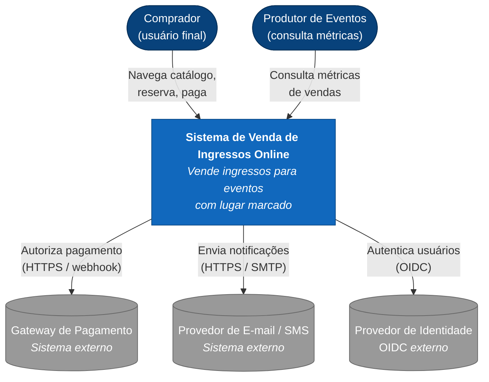

# Arquitetura de Sistema de Venda de Ingressos Online

> Estilo arquitetural: Monólito Modular com Pipeline de Admissão e Comunicação Orientada a Eventos

> Relatório técnico para a disciplina de Arquitetura de Software (INFNET)

| | |
|---|---|
| **Autor** | Christian Chiavelli |
| **Disciplina** | Fundamentos de Design de Sistemas e Modelo C4 |
| **Data** | 2026-05-24 |
| **Versão** | 1.0 |

---

## Resumo

Esse repositório contém o relatório da disciplina Fundamentos de Design de Sistemas e Modelo C4, parte da pós-graduação em Arquitetura de Software na INFNET. O sistema modelado é uma plataforma de venda de ingressos online com lugar marcado, cobrindo desde a reserva temporária de assento até emissão do ingresso digital, pagamento e notificações. A decisão principal foi adotar um monólito modular organizado por bounded contexts, com um pipeline de admissão pra absorver picos de acesso e eventos de domínio pra desacoplar os fluxos não-transacionais do caminho crítico. Faz mais sentido do que microsserviços prematuros pro tamanho e maturidade que o sistema teria no início. Tentei modelar algo que faz sentido pro contexto que vivo no dia a dia. O caso específico (venda de ingressos) não é da minha empresa atual, mas os trade-offs que apareceram são bem parecidos com os que já enfrentei.

---

## Diagrama de Contexto (C4, Nível 1)

---

## Índice do Relatório

O relatório tem três documentos.

### [01: Contexto, Drivers e Atributos](./01-contexto-drivers-e-atributos.md)

Contexto do problema e requisitos não-funcionais.

- Sumário executivo e drivers de negócio
- Restrições técnicas, organizacionais e regulatórias
- Atributos de qualidade com métricas objetivas
- Conflitos e trade-offs entre atributos

### [02: Decisões Arquiteturais e Modelo C4](./02-decisoes-arquiteturais-e-modelo-c4.md)

As decisões formais e a estrutura do sistema.

- As 5 ADRs principais (monólito modular, seat-locking, waiting room, eventos, schemas isolados)
- Avaliação comparativa de oito estilos arquiteturais
- Modelo C4 nos três níveis: Contexto, Contêineres e Componentes

### [03: Contratos, Evolução e Conclusão](./03-contratos-evolucao-e-conclusao.md)

Operacionalização, propriedade de dados e roadmap.

- Contratos de serviço (HTTP e eventos) e consistência eventual vs forte
- Propriedade dos dados entre módulos e impacto nos times
- Trade-offs residuais, riscos, roadmap e referências

## Diagramas C4 — Versão Structurizr

Os mesmos três níveis de C4 estão também versionados em [`c4-structurizr/workspace.dsl`](./c4-structurizr/workspace.dsl), no DSL oficial do Structurizr (a ferramenta de referência do C4 Model, mantida pelo Simon Brown). Os diagramas em Mermaid embutidos no relatório foram escolhidos pela simplicidade de renderização em texto puro; a versão em DSL serve como fonte única para gerar variantes (PNG, SVG, PlantUML) e como prova de que a estrutura segue o padrão C4 canônico.

---

## Decisões em Uma Linha

| ADR | Decisão |
|---|---|
| 001 | Monólito modular agora; microsserviços só quando métricas justificarem |
| 002 | Seat-locking via reserva temporária com TTL e índice único parcial (transação ACID local) |
| 003 | Virtual waiting room na borda pra absorver picos e garantir fairness |
| 004 | Outbox + broker gerenciado pra eventos de domínio com idempotência |
| 005 | Schemas isolados por módulo no mesmo cluster; sem cross-schema joins |

---

## Como Ler Este Repositório

- Os diagramas estão em Mermaid.
- Os três arquivos `.md` foram escritos pra ser lidos em sequência, mas dá pra ir direto no 02 se o interesse for só nas decisões arquiteturais.
- Os ADRs seguem o formato do Michael Nygard (contexto, decisão, alternativas, trade-offs). Acabei adotando porque foi o que mais apareceu nas referências da disciplina.
- O modelo C4 tem três níveis consistentes entre si: Contexto, Contêineres e Componentes.

---

## Referências Principais

As fontes que mais influenciaram as decisões foram Richards & Ford (*Fundamentals of Software Architecture*, 2020 e *The Hard Parts*, 2021), o modelo C4 do Simon Brown e o *Monolith to Microservices* do Newman. A lista completa está em [03: Referências Bibliográficas](./03-contratos-evolucao-e-conclusao.md#19-referências-bibliográficas).
